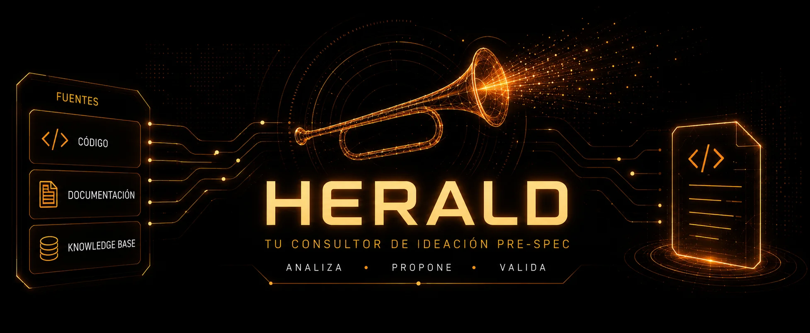

<div align="center">



# 📯 herald

**Tu consultor de ideación pre-spec.** Una skill que convierte ideas sueltas, documentación e **código real (read-only)** en una propuesta de implementación validada — separando lo que el sistema **hace hoy** de lo que **proponés construir** — y la entrega lista a tu flujo de specs.

[](LICENSE)
[](SKILL.md)
[](#la-regla-de-oro)
[](https://www.skills.sh/3zequiel3/herald)

</div>

---

## Qué es

herald es el **paso de ideación que va _antes_ de escribir specs**. Le das material crudo y te devuelve una **idea consolidada + propuesta de implementación** — factibilidad, gap analysis, diseño de integración, riesgos y supuestos — con una línea dura entre **el hecho citado** y **la propuesta marcada**. Después la entrega como un **seed** listo para tu flujo de Spec-Driven Development.

```
material crudo                    herald                    seed handoff
├── docs / .md       ──────►  ┌───────────────┐  ──────►  ## Idea
├── imágenes/prompts          │ Ideate/Bridge │           ## Base factual (citada)
├── src/  (read-only)         │   hecho  ≠    │           ## Propuesta  [marcada]
└── (otro sistema…)           │   propuesta   │           ## Riesgos / open-q
                              └───────────────┘           →  /sdd-new · opsx · …
```

Es la hermana — y el **opuesto** — de [`chronicle`](https://www.skills.sh/3zequiel3/chronicle):

| | **chronicle** | **herald** |
|---|---|---|
| Rol | 📚 Notario | 💡 Consultor |
| Trabajo | Documenta lo que **existe** | Propone lo que **todavía no existe** |
| Inventa | Nada | Propuestas — pero **siempre marcadas como tales** |

Esa última fila es el punto central: herald *tiene permitido* proponer, así que lo único que lo mantiene honesto es esa línea dura. **Nunca te vende una suposición como si fuera un hecho.**

---

## Empezá acá

1. **Instalá la skill** — publicada en **[skills.sh](https://www.skills.sh/3zequiel3/herald)**:
   ```bash
   npx skills add 3zequiel3/herald        # al proyecto actual
   npx skills add 3zequiel3/herald -g     # o global, para todos tus proyectos
   ```
   > Funciona en Claude Code, Cursor, Codex, Copilot, Gemini y cualquier agente que siga la spec de [Agent Skills](https://skills.sh).
2. **Pedísela en lenguaje natural** — se activa sola al detectar la intención:
   ```text
   "¿se puede integrar el registro de usuarios entre A y B?"
   ```
3. **Obtenés** una propuesta con el **hecho citado separado de la propuesta marcada**, parás en el **approval gate**, y al aprobar sale el **seed** hacia tu flujo de specs — sin una línea de código tocada.

¿No sabés qué modo necesitás? No importa: herald lo detecta solo y te lo confirma.

---

## Los dos modos

Un **router** elige el modo según cuántos sistemas hay en juego, tras un embudo de detección barato:

| Modo | Cuándo | Qué hace |
|------|--------|----------|
| 🟢 **Ideate** | **Un** sistema | Propone una feature o mejora: groundea la rebanada relevante y pregunta lo que importa — qué problema resuelve, qué toca, si escala, cuál es la versión mínima que aporta valor. |
| 🔵 **Bridge** | **Dos o más** sistemas | Todo lo de Ideate **más** las preguntas de integración que hunden proyectos en silencio: **fuente de verdad**, dirección del sync, tiempo real vs batch, fallo parcial, idempotencia, consistencia eventual, el contrato entre sistemas. |

```text
# Ejemplos de invocación
"proponé un sistema de referidos para mi marketplace"     → Ideate
"¿vale la pena meter websockets acá, o polling alcanza?"  → Ideate
"integrá A con B: registro cruzado de usuarios"           → Bridge
"se me ocurre conectar el CRM con el sistema de pagos"     → Bridge
```

> **Tracks (ortogonal al modo):** para un cambio chico y nombrable (un campo, un endpoint), herald usa el track **Express** — *draft-first*: propone primero y pregunta solo lo que bloquea. Para algo grande, ambiguo o un Bridge, usa el track **Full**: la batería completa antes de consolidar. El gate y la disciplina hecho/propuesta son obligatorios en los dos.

---

## La regla de oro

> **El código se LEE pero NUNCA se modifica.**
> **Cada afirmación es hecho citado _o_ propuesta marcada — jamás se mezclan.**

herald es **consultor**, no notario: puede proponer lo que no existe. El precio de esa libertad es la disciplina — toda línea lleva su cita de procedencia (`[code · file#symbol]`, `[kb · nodo]`, `[doc · …]`) **o** su marca especulativa (`[proposal]`, `[assumption]`, `[risk]`, `[open-q]`). Una propuesta nunca se escribe en voz de hecho.

Y hay dos garantías más que no dependen de la buena voluntad del modelo:

- **El gate necesita un humano.** herald nunca auto-aprueba. Sin un aprobador (corrida headless), devuelve la propuesta **sin handoff** (`needs-approval`) y no dispara nada. La ausencia de humano no es permiso.
- **Ante la duda, degrada ruidoso.** Frescura incierta, versión de ledger desconocida o una lectura delegada sin verificar → re-groundea, baja a `⚠ unverified` o se planta — en voz alta, nunca en silencio. **La palabra del usuario gana sobre cualquier heurística.**

---

## Más a fondo

<details>
<summary><b>🛡️ La disciplina: hecho vs propuesta</b></summary>

<br>

Cada línea que herald escribe está etiquetada, así nunca tenés que adivinar sobre qué está parada:

```
El Sistema A registra usuarios vía POST /api/register.   [code · src/auth/register.ts#register]
El Sistema B guarda usuarios en una tabla `users`.       [kb · 04_modelo]
La doc de integración describe un batch nocturno.        [doc · PLAN.md §Sync]  ⚠ unverified
[proposal] Al registrarse en A, emitir un evento `user.created` que B consume.
[assumption] B acepta IDs de usuario creados externamente sin colisión.
[risk] Si A está caído durante la escritura de B, el registro cruzado se pierde salvo que se encole.
[open-q] ¿Tiempo real, o es aceptable consistencia eventual?
```

Los hechos se citan. Las propuestas se marcan y se escriben en voz de propuesta. Las fuentes desactualizadas o sin verificar se señalan. Ese etiquetado **viaja dentro del seed**, así tu flujo de specs hereda las salvedades en vez de redescubrirlas.

</details>

<details>
<summary><b>🧊 Grounding con conciencia de frescura</b></summary>

<br>

herald es **agnóstico a la fuente** — usa una knowledge base de `chronicle`, una hecha a mano, o directamente el código. Lo que le importa es la *confianza*, en cuatro estados:

- **fresh** — hay un ledger `.ledger/fingerprints.json` y el chequeo de staleness pasa → usa el cache, el camino más barato.
- **stale** (o vos decís que está desactualizado) → **el código pasa a ser la fuente de verdad**; herald re-groundea la rebanada relevante desde el código real.
- **unverifiable** — hay KB/docs pero sin ledger de frescura → no asume; te pregunta o hace un spot-check.
- **user-trusted** — vos avalás una fuente que no se puede auto-verificar → la usa, pero marca cada afirmación `⚠ user-trusted`.

La ausencia de evidencia de staleness **no** es evidencia de frescura. Un "hecho" sacado de una doc vieja es ficción con cita — y herald lo trata como tal.

> **Ledger compartido con chronicle.** herald y `chronicle` (≥ v2.12) comparten una sola carpeta `.ledger/` en la raíz del proyecto. chronicle escribe el mapa de fingerprints; herald lo lee para evaluar frescura sin conocer las tripas de chronicle. Si no existe, herald igual funciona: lee el código directo (delegando a un explorer read-only — el `Explore` genérico o su propio sub-agente acotado) y puede sembrar el ledger él mismo.

</details>

<details>
<summary><b>⚡ Express vs Full — para el día a día</b></summary>

<br>

El track lo decide el **tamaño del pedido**, no si tenés chronicle:

- **Express** (`agregale un campo X`, `sumá este endpoint`) → *draft-first*: groundea la rebanada (del cache si está fresco, o de **una** lectura delegada acotada si no), **propone de una**, y pregunta solo el hueco que bloquea. Va directo al gate.
- **Full** (algo grande/ambiguo, o cualquier Bridge) → la batería de preguntas completa antes de consolidar. La integración no se improvisa.

En los dos casos el approval gate y la separación hecho/propuesta son **obligatorios** — Express cambia el *orden* y la *profundidad* de las preguntas, nunca la disciplina.

</details>

<details>
<summary><b>🌱 El seed y su fuerza</b></summary>

<br>

Al aprobar, herald arma un **seed**: un prompt base estructurado que tu flujo de specs corre sin arrancar de cero.

```
## Idea
## Base factual (grounded, citada)
## Propuesta              [proposal] / [assumption]
## Diseño de integración  (Ideate: la forma del cambio | Bridge: contrato, mapeo, sync, fallo, idempotencia)
## Riesgos, supuestos, preguntas abiertas
## Primer slice sugerido (MVP)   ← si es grande, un slicing ordenado en vez de un blob
```

En el gate ves también la **fuerza del seed** — `solid` / `partial` / `thin`, derivada mecánicamente del coverage de grounding (cuánto se apoya en código fresco vs fuentes sin verificar). Así aprobás sabiendo qué tan firme es la base, y el mismo número viaja al flujo aguas abajo.

</details>

<details>
<summary><b>🤖 Standalone u orquestada (headless)</b></summary>

<br>

**Standalone:** ¿no hay flujo de specs ni orquestador? herald igual corre todo el proceso y te entrega el seed en el chat, con el comando exacto del flujo que detecte.

**Orquestada:** herald es **flow-agnostic** — no hardcodea `/sdd-new`, entrega al flujo que esté instalado (SDD, opsx, o el que sea). Pegá esto en el archivo de instrucciones de tu orquestador:

```markdown
## herald — pre-spec ideation (front of funnel)

Route to herald when the user asks to ideate or propose something not yet spec'd
(single-system feature → Ideate; cross-system integration → Bridge). Do NOT route to
herald when the idea is already consolidated and code-grounded (go to /sdd-new), when
the user wants existing code documented (use chronicle), or when code must be written.

herald grounds in real code (read-only), separates fact from proposal, and STOPS at a
mandatory human approval gate. On approval it returns { status, mode, seed,
seed_strength, grounding_notes, next_action } and hands off to whichever spec flow is
installed (it does NOT hard-code /sdd-new):

- status: seed-ready     → fire the detected flow's entry (/sdd-new for SDD, opsx's
                           entry for opsx) with `seed`; carry grounding_notes forward.
- status: needs-approval → headless run, no human approver; surface the proposal,
                           do NOT auto-approve or hand off.
- status: inline-only    → no flow detected; present the proposal, suggest installing one.
- status: aborted        → user declined at the gate; do nothing downstream.

Chain: ideation → herald → seed → (SDD / opsx / …) → explore → propose → …
```

</details>

<details>
<summary><b>🚫 Lo que herald nunca hace</b></summary>

<br>

- ✋ Modificar, refactorizar o escribir código fuente — **solo lectura, siempre.**
- ✋ Presentar una propuesta, un supuesto o un riesgo como si fuera un hecho verificado.
- ✋ Entregar algo sin tu aprobación en el gate — ni auto-aprobar en una corrida headless.
- ✋ Lanzar subagentes de spec por su cuenta — devuelve un seed; el orquestador corre el protocolo.
- ✋ Persistir un artefacto propio — su entregable es la propuesta y el seed, nada más.

</details>

<details>
<summary><b>🗂️ Estructura</b></summary>

<br>

```
herald/
├── SKILL.md                          # router liviano + núcleo no-negociable
└── assets/
    ├── detection-funnel.md           # detecta sistemas + modo + track (barato primero)
    ├── grounding.md                  # cuatro estados de frescura, código-como-verdad, lectura delegada
    ├── ledger-contract.md            # el .ledger/ compartido con chronicle (esquema, ownership, interop)
    ├── ideate-interview.md           # batería single-system + draft-first
    ├── bridge-interview.md           # batería de integración cross-system
    ├── consolidation.md              # estructura de la propuesta + approval gate
    ├── seed-contract.md              # estructura del seed + seed_strength + contrato de retorno
    ├── orchestrator-integration.md   # detección de flujo + handshake + bloque pegable
    ├── provenance.md                 # taxonomía hecho vs propuesta + flags de frescura
    ├── edge-cases.md                 # conflictos, inputs faltantes, self-check final
    └── examples.md                   # un ejemplo trabajado por modo
```

> Nada se carga de una: el embudo de detección siempre corre, y cada asset se lee solo cuando el paso activo lo necesita.

</details>

---

## Contribuir

Las contribuciones son bienvenidas. Abrí un issue para discutir cambios grandes antes de un PR. La skill vive en `SKILL.md` (el contrato) y `assets/` (los recursos cargados bajo demanda).

## Licencia

[Apache-2.0](LICENSE) — proyecto original de Ezequiel González.

<div align="center">
<sub>herald propone. chronicle documenta. Vos decidís.</sub>
</div>
